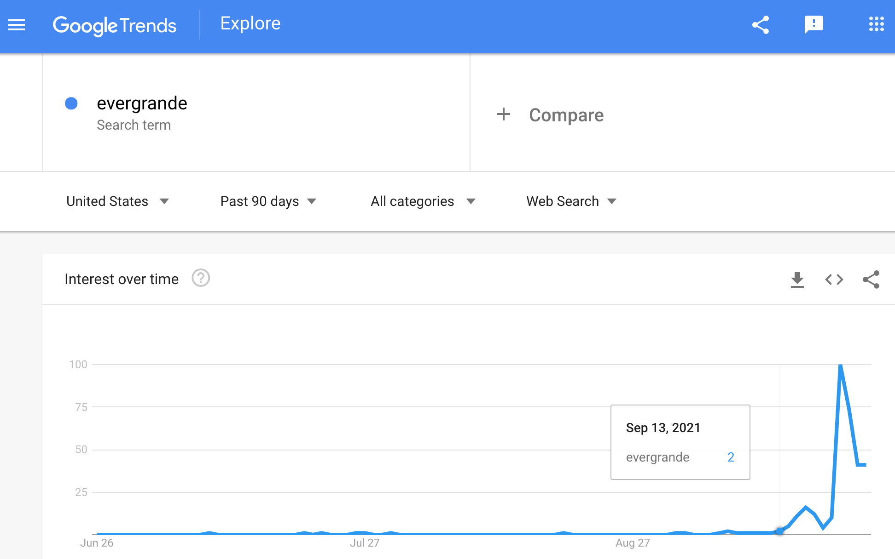

# GameStop News DD

## Chronilogical order of news.gamestop.com posts with closing price:

| Title                                                                                                                                                                                                                                                                                                                      | Release Date | Stock Price Close | Stock Price Open | Day Difference | High    | Low     |
| -------------------------------------------------------------------------------------------------------------------------------------------------------------------------------------------------------------------------------------------------------------------------------------------------------------------------- | ------------ | ----------------- | ---------------- | -------------- | ------- | ------- |
| [GameStop Announces Next Level of Black Friday Deals](https://news.gamestop.com/news-releases/news-release-details/gamestop-announces-next-level-black-friday-deals)                                                                                                                                                       | 11/20/2020   | $12.71            | $12.55           | -$0.16         | $13.46  | $12.54  |
| [GameStop Announces Third Quarter Fiscal 2020 Earnings Release Date](https://news.gamestop.com/news-releases/news-release-details/gamestop-announces-third-quarter-fiscal-2020-earnings-release)                                                                                                                           | 11/24/2020   | $13.67            | $14.23           | $0.56          | $14.26  | $13.30  |
| [GameStop Announces 2020 Cyber Week Deals](https://news.gamestop.com/news-releases/news-release-details/gamestop-announces-2020-cyber-week-deals)                                                                                                                                                                          | 11/29/2020   | $16.56            | $18.17           | $1.61          | $19.42  | $16.56  |
| [GameStop Reports Third Quarter Results, A Positive Start to Fourth Quarter with November Comparable Store Sales Increasing 16.5% And Sustained Progress Toward Long-Term Strategic Objectives](https://news.gamestop.com/news-releases/news-release-details/gamestop-reports-third-quarter-results-positive-start-fourth) | 12/8/2020    | $16.94            | $16.37           | -$0.57         | $17.21  | $15.93  |
| [GameStop Announces Additional Board Refreshment to Accelerate Transformation](https://news.gamestop.com/news-releases/news-release-details/gamestop-announces-additional-board-refreshment-accelerate)                                                                                                                    | 1/11/2021    | $19.94            | $19.41           | -$0.53         | $20.65  | $19.01  |
| [GameStop Reports 2020 Holiday Sales Results](https://news.gamestop.com/news-releases/news-release-details/gamestop-reports-2020-holiday-sales-results)                                                                                                                                                                    | 1/11/2021    | $19.94            | $19.41           | -$0.53         | $20.65  | $19.01  |
| [GameStop Earns Top Marks in Human Rights Campaign’s 2021 Corporate Equality Index](https://news.gamestop.com/news-releases/news-release-details/gamestop-earns-top-marks-human-rights-campaigns-2021-corporate)                                                                                                           | 1/28/2021    | $58.82            | $265.00          | $206.18        | $483.00 | $112.25 |
| [GameStop Appoints Chief Technology Officer](https://news.gamestop.com/news-releases/news-release-details/gamestop-appoints-chief-technology-officer)                                                                                                                                                                      | 2/3/2021     | $92.41            | $112.01          | $19.60         | $113.40 | $85.25  |
| [GameStop Announces Resignation of CFO and Succession Plan to Support Transformation](https://news.gamestop.com/news-releases/news-release-details/gamestop-announces-resignation-cfo-and-succession-plan-support)                                                                                                         | 2/23/2021    | $44.97            | $44.97           | $0.00          | $46.23  | $40.00  |
| [GameStop Provides Corporate Governance Update](https://news.gamestop.com/news-releases/news-release-details/gamestop-provides-corporate-governance-update)                                                                                                                                                                | 3/8/2021     | $194.50           | $154.89          | -$39.61        | $210.87 | $146.10 |
| [GameStop Announces Fourth Quarter and Fiscal Year 2020 Earnings Release Date](https://news.gamestop.com/news-releases/news-release-details/gamestop-announces-fourth-quarter-and-fiscal-year-2020-earnings)                                                                                                               | 3/9/2021     | $246.90           | $217.71          | -$29.19        | $249.85 | $208.51 |
| [GameStop Reports Fourth Quarter and Fiscal 2020 Results](https://news.gamestop.com/news-releases/news-release-details/gamestop-reports-fourth-quarter-and-fiscal-2020-results)                                                                                                                                            | 3/23/2021    | $181.75           | $197.50          | $15.75         | $201.75 | $177.55 |
| [GameStop Appoints Chief Operating Officer](https://news.gamestop.com/news-releases/news-release-details/gamestop-appoints-chief-operating-officer)                                                                                                                                                                        | 3/23/2021    | $181.75           | $197.50          | $15.75         | $201.75 | $177.55 |
| [GameStop Appoints Chief Growth Officer](https://news.gamestop.com/news-releases/news-release-details/gamestop-appoints-chief-growth-officer)                                                                                                                                                                              | 3/30/2021    | $194.46           | $187.50          | -$6.96         | $204.30 | $182.00 |
| [GameStop Announces Preliminary Sales Results for the First Nine Weeks of Fiscal 2021 Reflecting an Approximately 11% Increase Compared to the Prior Year Period](https://news.gamestop.com/news-releases/news-release-details/gamestop-announces-preliminary-sales-results-first-nine-weeks)                              | 4/5/2021     | $186.95           | $171.00          | -$15.95        | $195.00 | $164.81 |
| [GameStop Announces At-The-Market Equity Offering Program](https://news.gamestop.com/news-releases/news-release-details/gamestop-announces-market-equity-offering-program)                                                                                                                                                 | 4/5/2021     | $186.95           | $171.00          | -$15.95        | $195.00 | $164.81 |
| [GameStop Announces Slate of Director Candidates for 2021 Annual Meeting of Stockholders](https://news.gamestop.com/news-releases/news-release-details/gamestop-announces-slate-director-candidates-2021-annual-meeting)                                                                                                   | 4/8/2021     | $170.26           | $185.88          | $15.62         | $185.88 | $164.30 |
| [GameStop Announces Voluntary Early Redemption of Senior Notes](https://news.gamestop.com/news-releases/news-release-details/gamestop-announces-voluntary-early-redemption-senior-notes-0)                                                                                                                                 | 4/13/2021    | $140.99           | $141.88          | $0.89          | $145.38 | $132.00 |
| [GameStop Announces Chief Executive Officer Succession Plan](https://news.gamestop.com/news-releases/news-release-details/gamestop-announces-chief-executive-officer-succession-plan)                                                                                                                                      | 4/19/2021    | $164.37           | $171.80          | $7.43          | $175.20 | $162.33 |
| [GameStop Completes At-The-Market Equity Offering Program](https://news.gamestop.com/news-releases/news-release-details/gamestop-completes-market-equity-offering-program)                                                                                                                                                 | 4/26/2021    | $168.93           | $150.89          | -$18.04        | $174.68 | $148.76 |
| [GameStop Completes Voluntary Early Redemption of Senior Notes](https://news.gamestop.com/news-releases/news-release-details/gamestop-completes-voluntary-early-redemption-senior-notes)                                                                                                                                   | 5/3/2021     | $162.20           | $177.49          | $15.29         | $177.49 | $159.61 |
| [GameStop Expands Fulfillment Network with New Facility in York, Pennsylvania](https://news.gamestop.com/news-releases/news-release-details/gamestop-expands-fulfillment-network-new-facility-york)                                                                                                                        | 5/3/2021     | $162.20           | $177.49          | $15.29         | $177.49 | $159.61 |
| [nft.gamestop.com pop up](https://www.reddit.com/r/Superstonk/comments/nky0n0/gamestop_has_an_nft_website_setup)                                                                                                                                                                                                           | 5/25/2021    | $209.43           | $181.00          | -$28.43        | $217.11 | $181.00 |
| [GameStop Announces First Quarter Fiscal 2021 Earnings Release Date and Confirms Annual Shareholder Meeting Date](https://news.gamestop.com/news-releases/news-release-details/gamestop-announces-first-quarter-fiscal-2021-earnings-release)                                                                              | 6/2/2021     | $282.24           | $248.88          | -$33.36        | $294.00 | $244.30 |
| [GameStop Announces Appointments of Chief Executive Officer and Chief Financial Officer](https://news.gamestop.com/news-releases/news-release-details/gamestop-announces-appointments-chief-executive-officer-and)                                                                                                         | 6/9/2021     | $302.56           | $303.12          | $0.56          | $328.00 | $291.51 |
| [GameStop Releases First Quarter 2021 Financial Results](https://news.gamestop.com/news-releases/news-release-details/gamestop-releases-first-quarter-2021-financial-results)                                                                                                                                              | 6/9/2021     | $302.56           | $303.12          | $0.56          | $328.00 | $291.51 |
| [GameStop Appoints Matt Furlong to Board of Directors](https://news.gamestop.com/news-releases/news-release-details/gamestop-appoints-matt-furlong-board-directors)                                                                                                                                                        | 6/21/2021    | $200.37           | $216.95          | $16.58         | $218.40 | $197.00 |
| [GameStop Completes At-The-Market Equity Offering Program](https://news.gamestop.com/news-releases/news-release-details/gamestop-completes-market-equity-offering-program-0)                                                                                                                                               | 6/22/2021    | $220.40           | $217.73          | -$2.67         | $225.88 | $209.17 |
| [GameStop Continues Expansion of Fulfillment Network with New Facility in Reno, Nevada](https://news.gamestop.com/news-releases/news-release-details/gamestop-continues-expansion-fulfillment-network-new-facility)                                                                                                        | 7/6/2021     | $199.56           | $204.00          | $4.44          | $204.77 | $193.71 |
| [GameStop to Rebrand EB Games in Canada](https://news.gamestop.com/news-releases/news-release-details/gamestop-rebrand-eb-games-canada)                                                                                                                                                                                    | 7/28/2021    | $169.12           | $175.72          | $6.60          | $177.12 | $164.27 |
| [GameStop Announces Second Quarter Fiscal 2021 Earnings Release Date](https://news.gamestop.com/news-releases/news-release-details/gamestop-announces-second-quarter-fiscal-2021-earnings-release)                                                                                                                         | 8/25/2021    | $199.65           | $206.65          | $7.00          | $227.00 | $193.00 |
| [GameStop Reports Financial Results for Q2 2021](https://news.gamestop.com/news-releases/news-release-details/gamestop-reports-financial-results-q2-2021)                                                                                                                                                                  | 9/8/2021     | $198.80           | $201.86          | $3.06          | $206.88 | $190.68 |
| [GameStop to Hire up to 500 Employees at New Customer Care Center in South Florida](https://news.gamestop.com/news-releases/news-release-details/gamestop-hire-500-employees-new-customer-care-center-south)                                                                                                               | 9/20/2021    | $192.20           | $200.00          | $7.80          | $202.85 | $184.55 |

### Chart

## RC Ventures Events:

| Title                                                                                                                              | Release Date | Stock Price Close | Stock Price Open |
| ---------------------------------------------------------------------------------------------------------------------------------- | ------------ | ----------------- | ---------------- |
| [13D Filing - 5,800,000 shares owned](https://www.sec.gov/Archives/edgar/data/1326380/000101359420000670/rc13d-082820.htm)         | 8/18/2020    | $4.81             | $4.61            |
| [13D Filing - 6,215,326 shares owned](https://www.sec.gov/Archives/edgar/data/1326380/000101359420000673/rc13da1-083120.htm)       | 8/28/2020    | $5.39             | $5.30            |
| [13D Filing - 6,500,000 shares owned](https://www.sec.gov/Archives/edgar/data/1326380/000101359420000699/rc13da2-091820.htm)       | 9/21/2020    | $8.75             | $9.35            |
| [Letter to the board](https://www.sec.gov/Archives/edgar/data/1326380/000101359420000821/rc13da3-111620.pdf)                       | 11/16/2020   | $12.06            | $11.16           |
| [Form 4 - 9,001,000 shares owned](https://www.sec.gov/Archives/edgar/data/1326380/000119380520001580/xslF345X03/e620155_4-gme.xml) | 12/18/2020   | $15.63            | $15.78           |

## DFV Events:

| Title                                                                                                                                     | Release Date | Stock Price Close | Stock Price Open |
| ----------------------------------------------------------------------------------------------------------------------------------------- | ------------ | ----------------- | ---------------- |
| [Double Down](https://www.reddit.com/r/wallstreetbets/comments/m0q5bm/gme_yolo_update_mar_8_2021/)                                        | 3/8/2021     | $194.50           | $154.89          |
| [Exercise Calls + buy 50k more shares](https://www.reddit.com/r/wallstreetbets/comments/msblc3/gme_yolo_update_apr_16_2021_final_update/) | 4/16/2021    | $154.69           | $156.00          |

## Bad Events Analysis

| Title                                                                                                                        | Release Date | Stock Price Close | Stock Price Open |
| ---------------------------------------------------------------------------------------------------------------------------- | ------------ | ----------------- | ---------------- |
| [SEC Hearing](https://financialservices.house.gov/calendar/eventsingle.aspx?EventID=407107)                                  | 2/18/2021    | $40.69            | $48.49           |
| [SEC Hearing](https://www.youtube.com/watch?v=imRzHXRq80I)                                                                   | 3/17/2021    | $209.81           | $217.84          |
| [SEC Hearing](https://financialservices.house.gov/calendar/eventsingle.aspx?EventID=407748)                                  | 5/6/2021     | $161.08           | $160.86          |
| Buy button turned off - High of $483                                                                                         | 1/28/2021    | $193.60           | $265.00          |
| Evergrande first started on Google Trends                                                                                    | 9/14/2021    | $199.24           | $200.65          |
| [SS created and great migration started](https://www.reddit.com/r/Superstonk/)                                               | 3/15/2021    | $220.14           | $277.52          |
| [SS Mod Drama](https://www.reddit.com/r/Superstonk/comments/ojqrqh/mod_drama_got_me_like/)                                   | 7/13/2021    | $180.06           | $187.68          |
| [Burry is back!](https://www.reddit.com/r/Superstonk/comments/nzzb3s/michael_burry_is_back_this_is_bullish_af/)              | 6/14/2021    | $229.44           | $236.50          |
| [Game on Anon post](https://www.reddit.com/r/Superstonk/comments/ok2e0b/a_castle_of_glass_game_on_anon/)                     | 7/14/2021    | $167.72           | $180.49          |
| [House of cards 1](https://www.reddit.com/r/Superstonk/comments/mvk5dv/a_house_of_cards_part_1/)                             | 4/21/2021    | $158.53           | $164.14          |
| [House of cards 2](https://www.reddit.com/r/Superstonk/comments/nlwaxv/house_of_cards_part_2/)                               | 5/26/2021    | $242.56           | $229.00          |
| [House of cards 3](https://www.reddit.com/r/Superstonk/comments/nlwqyv/house_of_cards_part_3/)                               | 5/26/2021    | $242.56           | $229.00          |
| [u/Criand first post](https://www.reddit.com/r/Superstonk/comments/mv740t/january_22_february_19_march_5_april_16_the_only/) | 4/20/2021    | $158.53           | $164.14          |
| [u/Criand top post](https://www.reddit.com/r/Superstonk/comments/o0scoy/the_bigger_short_how_2008_is_repeating_at_a_much/)   | 6/15/2021    | $222.50           | $226.50          |

- Michael Burry Tweets
- Evergrande
- SS Mod Drama
- Buy button off
- SEC Hearing 1
- SEC Hearing 2
- SEC Hearing 3
