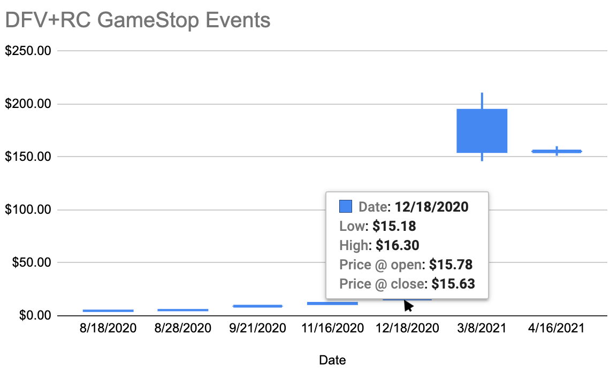

GameStop has always been the catalyst...

This is probably going to be a controversial post when I don't intend it to be (and it shouldn't be taken that way). My intentions are not to call anyone out or any specific event out. I write DD about GME and in my opinion, we have too many DD writers writing about things other than GME. I thought it would be a great exercise to look at the daily GME price information in relation to events that have happened in the GME timeline.

My theory is that information coming from news.gamestop.com has been more impactful than anything else with regards to GameStop's stock price. In this theory, the overall impact on the price trends up with time as GameStop has only released good news. The other part to my theory is that other events we discuss in our sub are much impactful to the price long-term, but may have some small short term impacts.

I will compare a couple groups of data:

- news.gamestop.com articles
- RC Ventures and DFV position events
- RC Tweets
- Other Events - i.e. Mod Drama

# new.gamestop.com Releases

I started back with 11/20/2021 for gathering articles from news.gamestop.com. Then I went into Yahoo Finance and grabbed the data for those specific dates (close, open, high, low). I dropped the data in Google Sheets and added a chart with a trendline. Here is the table:

| Title                                                                                                                                                                                                                                                                                                                      | Release Date | Stock Price Close | Stock Price Open | Day Difference | High    | Low     |
| -------------------------------------------------------------------------------------------------------------------------------------------------------------------------------------------------------------------------------------------------------------------------------------------------------------------------- | ------------ | ----------------- | ---------------- | -------------- | ------- | ------- |
| [GameStop Announces Next Level of Black Friday Deals](https://news.gamestop.com/news-releases/news-release-details/gamestop-announces-next-level-black-friday-deals)                                                                                                                                                       | 11/20/2020   | $12.71            | $12.55           | -$0.16         | $13.46  | $12.54  |
| [GameStop Announces Third Quarter Fiscal 2020 Earnings Release Date](https://news.gamestop.com/news-releases/news-release-details/gamestop-announces-third-quarter-fiscal-2020-earnings-release)                                                                                                                           | 11/24/2020   | $13.67            | $14.23           | $0.56          | $14.26  | $13.30  |
| [GameStop Announces 2020 Cyber Week Deals](https://news.gamestop.com/news-releases/news-release-details/gamestop-announces-2020-cyber-week-deals)                                                                                                                                                                          | 11/29/2020   | $16.56            | $18.17           | $1.61          | $19.42  | $16.56  |
| [GameStop Reports Third Quarter Results, A Positive Start to Fourth Quarter with November Comparable Store Sales Increasing 16.5% And Sustained Progress Toward Long-Term Strategic Objectives](https://news.gamestop.com/news-releases/news-release-details/gamestop-reports-third-quarter-results-positive-start-fourth) | 12/8/2020    | $16.94            | $16.37           | -$0.57         | $17.21  | $15.93  |
| [GameStop Announces Additional Board Refreshment to Accelerate Transformation](https://news.gamestop.com/news-releases/news-release-details/gamestop-announces-additional-board-refreshment-accelerate)                                                                                                                    | 1/11/2021    | $19.94            | $19.41           | -$0.53         | $20.65  | $19.01  |
| [GameStop Reports 2020 Holiday Sales Results](https://news.gamestop.com/news-releases/news-release-details/gamestop-reports-2020-holiday-sales-results)                                                                                                                                                                    | 1/11/2021    | $19.94            | $19.41           | -$0.53         | $20.65  | $19.01  |
| [GameStop Earns Top Marks in Human Rights Campaign’s 2021 Corporate Equality Index](https://news.gamestop.com/news-releases/news-release-details/gamestop-earns-top-marks-human-rights-campaigns-2021-corporate)                                                                                                           | 1/28/2021    | $193.60           | $265.00          | $206.18        | $483.00 | $112.25 |
| [GameStop Appoints Chief Technology Officer](https://news.gamestop.com/news-releases/news-release-details/gamestop-appoints-chief-technology-officer)                                                                                                                                                                      | 2/3/2021     | $92.41            | $112.01          | $19.60         | $113.40 | $85.25  |
| [GameStop Announces Resignation of CFO and Succession Plan to Support Transformation](https://news.gamestop.com/news-releases/news-release-details/gamestop-announces-resignation-cfo-and-succession-plan-support)                                                                                                         | 2/23/2021    | $44.97            | $44.97           | $0.00          | $46.23  | $40.00  |
| [GameStop Provides Corporate Governance Update](https://news.gamestop.com/news-releases/news-release-details/gamestop-provides-corporate-governance-update)                                                                                                                                                                | 3/8/2021     | $194.50           | $154.89          | -$39.61        | $210.87 | $146.10 |
| [GameStop Announces Fourth Quarter and Fiscal Year 2020 Earnings Release Date](https://news.gamestop.com/news-releases/news-release-details/gamestop-announces-fourth-quarter-and-fiscal-year-2020-earnings)                                                                                                               | 3/9/2021     | $246.90           | $217.71          | -$29.19        | $249.85 | $208.51 |
| [GameStop Reports Fourth Quarter and Fiscal 2020 Results](https://news.gamestop.com/news-releases/news-release-details/gamestop-reports-fourth-quarter-and-fiscal-2020-results)                                                                                                                                            | 3/23/2021    | $181.75           | $197.50          | $15.75         | $201.75 | $177.55 |
| [GameStop Appoints Chief Operating Officer](https://news.gamestop.com/news-releases/news-release-details/gamestop-appoints-chief-operating-officer)                                                                                                                                                                        | 3/23/2021    | $181.75           | $197.50          | $15.75         | $201.75 | $177.55 |
| [GameStop Appoints Chief Growth Officer](https://news.gamestop.com/news-releases/news-release-details/gamestop-appoints-chief-growth-officer)                                                                                                                                                                              | 3/30/2021    | $194.46           | $187.50          | -$6.96         | $204.30 | $182.00 |
| [GameStop Announces Preliminary Sales Results for the First Nine Weeks of Fiscal 2021 Reflecting an Approximately 11% Increase Compared to the Prior Year Period](https://news.gamestop.com/news-releases/news-release-details/gamestop-announces-preliminary-sales-results-first-nine-weeks)                              | 4/5/2021     | $186.95           | $171.00          | -$15.95        | $195.00 | $164.81 |
| [GameStop Announces At-The-Market Equity Offering Program](https://news.gamestop.com/news-releases/news-release-details/gamestop-announces-market-equity-offering-program)                                                                                                                                                 | 4/5/2021     | $186.95           | $171.00          | -$15.95        | $195.00 | $164.81 |
| [GameStop Announces Slate of Director Candidates for 2021 Annual Meeting of Stockholders](https://news.gamestop.com/news-releases/news-release-details/gamestop-announces-slate-director-candidates-2021-annual-meeting)                                                                                                   | 4/8/2021     | $170.26           | $185.88          | $15.62         | $185.88 | $164.30 |
| [GameStop Announces Voluntary Early Redemption of Senior Notes](https://news.gamestop.com/news-releases/news-release-details/gamestop-announces-voluntary-early-redemption-senior-notes-0)                                                                                                                                 | 4/13/2021    | $140.99           | $141.88          | $0.89          | $145.38 | $132.00 |
| [GameStop Announces Chief Executive Officer Succession Plan](https://news.gamestop.com/news-releases/news-release-details/gamestop-announces-chief-executive-officer-succession-plan)                                                                                                                                      | 4/19/2021    | $164.37           | $171.80          | $7.43          | $175.20 | $162.33 |
| [GameStop Completes At-The-Market Equity Offering Program](https://news.gamestop.com/news-releases/news-release-details/gamestop-completes-market-equity-offering-program)                                                                                                                                                 | 4/26/2021    | $168.93           | $150.89          | -$18.04        | $174.68 | $148.76 |
| [GameStop Completes Voluntary Early Redemption of Senior Notes](https://news.gamestop.com/news-releases/news-release-details/gamestop-completes-voluntary-early-redemption-senior-notes)                                                                                                                                   | 5/3/2021     | $162.20           | $177.49          | $15.29         | $177.49 | $159.61 |
| [GameStop Expands Fulfillment Network with New Facility in York, Pennsylvania](https://news.gamestop.com/news-releases/news-release-details/gamestop-expands-fulfillment-network-new-facility-york)                                                                                                                        | 5/3/2021     | $162.20           | $177.49          | $15.29         | $177.49 | $159.61 |
| [nft.gamestop.com pop up](https://www.reddit.com/r/Superstonk/comments/nky0n0/gamestop_has_an_nft_website_setup)                                                                                                                                                                                                           | 5/25/2021    | $209.43           | $181.00          | -$28.43        | $217.11 | $181.00 |
| [GameStop Announces First Quarter Fiscal 2021 Earnings Release Date and Confirms Annual Shareholder Meeting Date](https://news.gamestop.com/news-releases/news-release-details/gamestop-announces-first-quarter-fiscal-2021-earnings-release)                                                                              | 6/2/2021     | $282.24           | $248.88          | -$33.36        | $294.00 | $244.30 |
| [GameStop Announces Appointments of Chief Executive Officer and Chief Financial Officer](https://news.gamestop.com/news-releases/news-release-details/gamestop-announces-appointments-chief-executive-officer-and)                                                                                                         | 6/9/2021     | $302.56           | $303.12          | $0.56          | $328.00 | $291.51 |
| [GameStop Releases First Quarter 2021 Financial Results](https://news.gamestop.com/news-releases/news-release-details/gamestop-releases-first-quarter-2021-financial-results)                                                                                                                                              | 6/9/2021     | $302.56           | $303.12          | $0.56          | $328.00 | $291.51 |
| [GameStop Appoints Matt Furlong to Board of Directors](https://news.gamestop.com/news-releases/news-release-details/gamestop-appoints-matt-furlong-board-directors)                                                                                                                                                        | 6/21/2021    | $200.37           | $216.95          | $16.58         | $218.40 | $197.00 |
| [GameStop Completes At-The-Market Equity Offering Program](https://news.gamestop.com/news-releases/news-release-details/gamestop-completes-market-equity-offering-program-0)                                                                                                                                               | 6/22/2021    | $220.40           | $217.73          | -$2.67         | $225.88 | $209.17 |
| [GameStop Continues Expansion of Fulfillment Network with New Facility in Reno, Nevada](https://news.gamestop.com/news-releases/news-release-details/gamestop-continues-expansion-fulfillment-network-new-facility)                                                                                                        | 7/6/2021     | $199.56           | $204.00          | $4.44          | $204.77 | $193.71 |
| [GameStop to Rebrand EB Games in Canada](https://news.gamestop.com/news-releases/news-release-details/gamestop-rebrand-eb-games-canada)                                                                                                                                                                                    | 7/28/2021    | $169.12           | $175.72          | $6.60          | $177.12 | $164.27 |
| [GameStop Announces Second Quarter Fiscal 2021 Earnings Release Date](https://news.gamestop.com/news-releases/news-release-details/gamestop-announces-second-quarter-fiscal-2021-earnings-release)                                                                                                                         | 8/25/2021    | $199.65           | $206.65          | $7.00          | $227.00 | $193.00 |
| [GameStop Reports Financial Results for Q2 2021](https://news.gamestop.com/news-releases/news-release-details/gamestop-reports-financial-results-q2-2021)                                                                                                                                                                  | 9/8/2021     | $198.80           | $201.86          | $3.06          | $206.88 | $190.68 |
| [GameStop to Hire up to 500 Employees at New Customer Care Center in South Florida](https://news.gamestop.com/news-releases/news-release-details/gamestop-hire-500-employees-new-customer-care-center-south)                                                                                                               | 9/20/2021    | $192.20           | $200.00          | $7.80          | $202.85 | $184.55 |

Here is the data charted out:

It really does seem that the GameStop news has had a positive trend with the price over time. I have personally found the news during this timeframe to be overall very positive and directly in-line with what the company has communicated to investors. As each piece of good news comes out, it convinces a couple more investors that the digital transformation is going to be successful.

# RC Ventures and DFV position events:

I'm grouping these two together into 1 table

| Title                                                                                                                                     | Release Date | Stock Price Close | Stock Price Open | Day Difference | High    | Low     |
| ----------------------------------------------------------------------------------------------------------------------------------------- | ------------ | ----------------- | ---------------- | -------------- | ------- | ------- |
| [13D Filing - 5,800,000 shares owned](https://www.sec.gov/Archives/edgar/data/1326380/000101359420000670/rc13d-082820.htm)                | 8/18/2020    | $4.81             | $4.61            | -$0.20         | $4.87   | $4.43   |
| [13D Filing - 6,215,326 shares owned](https://www.sec.gov/Archives/edgar/data/1326380/000101359420000673/rc13da1-083120.htm)              | 8/28/2020    | $5.39             | $5.30            | -$0.09         | $5.57   | $5.22   |
| [13D Filing - 6,500,000 shares owned](https://www.sec.gov/Archives/edgar/data/1326380/000101359420000699/rc13da2-091820.htm)              | 9/21/2020    | $8.75             | $9.35            | $0.60          | $9.60   | $8.38   |
| [Letter to the board](https://www.sec.gov/Archives/edgar/data/1326380/000101359420000821/rc13da3-111620.pdf)                              | 11/16/2020   | $12.06            | $11.16           | -$0.90         | $12.66  | $10.72  |
| [Form 4 - 9,001,000 shares owned](https://www.sec.gov/Archives/edgar/data/1326380/000119380520001580/xslF345X03/e620155_4-gme.xml)        | 12/18/2020   | $15.63            | $15.78           | $0.15          | $16.30  | $15.18  |
| [Double Down](https://www.reddit.com/r/wallstreetbets/comments/m0q5bm/gme_yolo_update_mar_8_2021/)                                        | 3/8/2021     | $194.50           | $154.89          | -$39.61        | $210.87 | $146.10 |
| [Exercise Calls + buy 50k more shares](https://www.reddit.com/r/wallstreetbets/comments/msblc3/gme_yolo_update_apr_16_2021_final_update/) | 4/16/2021    | $154.69           | $156.00          | $1.31          | $160.20 | $151.25 |

Here is what it would look like if we charted these events out:

# RC Tweets

Some of RC tweets happened on days the market was closed, so you'll see a "-" in those lines for the price and it will create a gap in the chart.

| Tweet Link                                               | Date       | Price @ close | Price @ open | Daily Difference | High    | Low     |
| -------------------------------------------------------- | ---------- | ------------- | ------------ | ---------------- | ------- | ------- |
| https://twitter.com/ryancohen/status/1336775515101949963 | 12/9/2020  | $13.66        | $13.92       | $0.26            | $14.73  | $13.23  |
| https://twitter.com/ryancohen/status/1344687817998401537 | 12/31/2020 | $18.84        | $19.25       | $0.41            | $19.80  | $28.80  |
| https://twitter.com/ryancohen/status/1346943412663177218 | 1/6/2021   | $18.36        | $17.34       | -$1.02           | $18.98  | $17.33  |
| https://twitter.com/ryancohen/status/1350877969816956934 | 1/17/2021  | -             | -            | -                | -       | -       |
| https://twitter.com/ryancohen/status/1364650709669601289 | 2/24/2021  | $91.71        | $44.70       | -$47.01          | $91.71  | $44.70  |
| https://twitter.com/ryancohen/status/1367555194196787206 | 3/4/2021   | $132.35       | $125.00      | -$7.35           | $147.87 | $115.30 |
| https://twitter.com/ryancohen/status/1370136976666595331 | 3/11/2021  | $260.00       | $241.64      | -$18.36          | $281.50 | $232.60 |
| https://twitter.com/ryancohen/status/1372270634374467587 | 3/17/2021  | $209.81       | $217.84      | $8.03            | $231.47 | $204.00 |
| https://twitter.com/ryancohen/status/1375159657166209031 | 3/25/2021  | $183.75       | $123.49      | -$60.26          | $187.50 | $116.90 |
| https://twitter.com/ryancohen/status/1380212953748676608 | 4/8/2021   | $170.26       | $185.88      | $15.62           | $185.88 | $164.30 |
| https://twitter.com/ryancohen/status/1381829698263654401 | 4/12/2021  | $141.09       | $158.11      | $17.02           | $163.90 | $135.05 |
| https://twitter.com/ryancohen/status/1383204653630914563 | 4/16/2021  | $154.69       | $156.00      | $1.31            | $160.20 | $151.25 |
| https://twitter.com/ryancohen/status/1384616641087086596 | 4/20/2021  | $158.53       | $164.14      | $5.61            | $164.89 | $153.36 |
| https://twitter.com/ryancohen/status/1385989779129503746 | 4/24/2021  | -             | -            | -                | -       | -       |
| https://twitter.com/ryancohen/status/1386485746916380673 | 4/25/2021  | -             | -            | -                | -       | -       |
| https://twitter.com/ryancohen/status/1387822832558788614 | 4/29/2021  | $176.19       | $176.56      | $0.37            | $180.86 | $170.75 |
| https://twitter.com/ryancohen/status/1392649234944507906 | 5/12/2021  | $144.79       | $145.70      | $0.91            | $150.50 | $142.23 |
| https://twitter.com/ryancohen/status/1394482434171973634 | 5/17/2021  | $180.60       | $159.85      | -$20.75          | $182.50 | $159.00 |
| https://twitter.com/ryancohen/status/1395047208748261379 | 5/19/2021  | $168.83       | $171.99      | $3.16            | $178.98 | $164.15 |
| https://twitter.com/ryancohen/status/1397047791889879041 | 5/24/2021  | $180.01       | $175.85      | -$4.16           | $188.46 | $173.35 |
| https://twitter.com/ryancohen/status/1398454505314959361 | 5/28/2021  | $222.00       | $262.97      | $40.97           | $268.80 | $221.43 |
| https://twitter.com/ryancohen/status/1399526466770059268 | 5/31/2021  | -             | -            | -                | -       | -       |
| https://twitter.com/ryancohen/status/1400492465442811904 | 6/3/2021   | $258.18       | $265.71      | $7.53            | $274.43 | $242.12 |
| https://twitter.com/ryancohen/status/1406678556436877315 | 6/20/2021  | -             | -            | -                | -       | -       |
| https://twitter.com/ryancohen/status/1407896835096678402 | 6/23/2021  | $219.34       | $221.45      | $2.11            | $222.57 | $213.12 |
| https://twitter.com/ryancohen/status/1410398196610723842 | 6/30/2021  | -             | -            | -                | -       | -       |
| https://twitter.com/ryancohen/status/1411737540210561036 | 7/4/2021   | -             | -            | -                | -       | -       |
| https://twitter.com/ryancohen/status/1413223954387406851 | 7/8/2021   | $191.38       | $179.83      | -$11.55          | $194.22 | $179.50 |
| https://twitter.com/ryancohen/status/1413669955984236545 | 7/9/2021   | $191.23       | $179.83      | -$11.40          | $194.78 | $186.75 |
| https://twitter.com/ryancohen/status/1417315406272864258 | 7/19/2021  | $173.49       | $163.30      | -$10.19          | $176.00 | $161.22 |
| https://twitter.com/ryancohen/status/1418751218566918146 | 7/23/2021  | $180.36       | $181.00      | $0.64            | $181.60 | $173.84 |
| https://twitter.com/ryancohen/status/1420411942846361612 | 7/28/2021  | $169.12       | $175.72      | $6.60            | $177.12 | $164.27 |
| https://twitter.com/ryancohen/status/1420940035042414595 | 7/29/2021  | $164.86       | $170.60      | $5.74            | $173.89 | $164.51 |
| https://twitter.com/ryancohen/status/1423766191311519747 | 8/6/2021   | $151.77       | $154.59      | $2.82            | $156.50 | $150.31 |
| https://twitter.com/ryancohen/status/1425606429574979584 | 8/11/2021  | $158.70       | $158.43      | -$0.27           | $159.05 | $154.62 |
| https://twitter.com/ryancohen/status/1428518642937892868 | 8/19/2021  | $152.90       | $156.77      | $3.87            | $157.99 | $150.78 |
| https://twitter.com/ryancohen/status/1431433651414306825 | 8/27/2021  | $204.95       | $207.70      | $2.75            | $213.00 | $200.02 |
| https://twitter.com/ryancohen/status/1442208550600671232 | 9/26/2021  | -             | -            | -                | -       | -       |

Here are the tweets charted out:

# Other Events

I'm sure there could be a lot of data points added to this set, I just tried taking more known events and used them as examples. I defintely am not trying to say any of the DD posts in here are a waste of time or don't matter; that is not my intention. I personally believe these events just have less meaning than the news GameStop is releasing directly on their site.

| Title                                                                                                                                              | Release Date | Stock Price Close | Stock Price Open | Day Difference | High    | Low     |
| -------------------------------------------------------------------------------------------------------------------------------------------------- | ------------ | ----------------- | ---------------- | -------------- | ------- | ------- |
| Buy button turned off - High of $483                                                                                                               | 1/28/2021    | $193.60           | $265.00          | $206.18        | $483.00 | $112.25 |
| [SEC Hearing](https://financialservices.house.gov/calendar/eventsingle.aspx?EventID=407107)                                                        | 2/18/2021    | $40.69            | $48.49           |                | 48.87   |
| [SS created and great migration started](https://www.reddit.com/r/Superstonk/)                                                                     | 3/15/2021    | $220.14           | $277.52          |
| [SEC Hearing](https://www.youtube.com/watch?v=imRzHXRq80I)                                                                                         | 3/17/2021    | $209.81           | $217.84          |
| [u/Criand first post](https://www.reddit.com/r/Superstonk/comments/mv740t/january_22_february_19_march_5_april_16_the_only/)                       | 4/20/2021    | $158.53           | $164.14          |
| [House of cards 1](https://www.reddit.com/r/Superstonk/comments/mvk5dv/a_house_of_cards_part_1/)                                                   | 4/21/2021    | $158.53           | $164.14          |
| [Elliot Wave Guy Theory Starts](https://www.reddit.com/r/Superstonk/comments/n0qnpv/predicting_gmes_price_action_with_elliot_waves_429/)           | 4/28/2021    |
| [Exponential Floor Guy Announces Theory](https://www.reddit.com/r/Superstonk/comments/n1rgfl/played_around_with_logscale_ta_and_noticed/)          | 4/30/2021    |
| [SEC Hearing](https://financialservices.house.gov/calendar/eventsingle.aspx?EventID=407748)                                                        | 5/6/2021     | $161.08           | $160.86          |
| [u/Criand T+21 and T+35 Theories Introduced](https://www.reddit.com/r/Superstonk/comments/nf22qz/theory_on_the_ftd_loop_missing_link_a_t35_surge/) | 5/17/2021    |
| [Exponential Floor Guy Starts Regular Updates](https://www.reddit.com/r/Superstonk/comments/nhx3js/still_following_the_exponential_floor_as_of/)   | 5/21/2021    |
| [House of cards 2](https://www.reddit.com/r/Superstonk/comments/nlwaxv/house_of_cards_part_2/)                                                     | 5/26/2021    | $242.56           | $229.00          |
| [House of cards 3](https://www.reddit.com/r/Superstonk/comments/nlwqyv/house_of_cards_part_3/)                                                     | 5/26/2021    | $242.56           | $229.00          |
| [Burry is back!](https://www.reddit.com/r/Superstonk/comments/nzzb3s/michael_burry_is_back_this_is_bullish_af/)                                    | 6/14/2021    | $229.44           | $236.50          |
| [u/Criand top post](https://www.reddit.com/r/Superstonk/comments/o0scoy/the_bigger_short_how_2008_is_repeating_at_a_much/)                         | 6/15/2021    | $222.50           | $226.50          |
| [SS Mod Drama - rensole, redchessqueen and hey_madie](https://www.reddit.com/r/Superstonk/comments/ojqrqh/mod_drama_got_me_like/)                  | 7/13/2021    | $180.06           | $187.68          |
| [Game on Anon post](https://www.reddit.com/r/Superstonk/comments/ok2e0b/a_castle_of_glass_game_on_anon/)                                           | 7/14/2021    | $167.72           | $180.49          |
| [gherkinit T+69 cycle theory](https://www.reddit.com/r/GMEJungle/comments/pk1ptp/t69/)                                                             | 9/7/2021     |
| Evergrande first started on Google Trends                                                                                                          | 9/14/2021    | $199.24           | $200.65          |

_Source for Evergrande trending_

Here are the other events charted out:

# Looking at the data sets

**news.gamestop.com** - We can definitely see a positive trend overtime with the price. You **SHOULD NOT** take this graph as some sort of "cycle"; it may kinda look like that but there is no way of knowing when new posts will come up on news.gamestop.com and how the market will react to it. I suggest you take a moment to read through some of the titles in the table above and see how the story has progressed.

**RC Ventures and DFV postition events** - It's hard to say here because there are so few events here. We all know about DFV's double down post which had an obvious movement on the price that day. Other than that, we see little here mainly becuase they both were early in the saga. I only used DFV's latest posts because he had so many regular posts and those 2 were the most popular.

**RC Tweets** - There are definitely some really interesting data points here. You can see a downward trend in the start of July with RC's tweets, but overall the trend seems to look like an exponential curve that is plateuing. I mainly put this data set in because I thought people would want to see it, I did. RC tweets definitely have had some short term price movements

**Other Events** - This chart just screams "nothing" to me. The two days with the largest spreads was when the buy button was turned off and the SS migration during the second sneeze. Each other event didn't have a lasting impact on the price and the events all hover around $200.

It really does look like a lot of the prominent events in the GameStop cycle have been distractions to the real transformation news GameStop has been putting out there. MSM always cries they haven't heard the story from GameStop, but I feel like they've been telling us a lot for awhile and we've been too busy looking at distractions rather than GameStop itself.

# tl;dr: Reddit talking about GameStop's successful digital transformation is a SHF worst nightmare, they would rather us talk about literally ANYTHING else

CALL TO ACTION - GameStop DD Authors should try to focus research on GameStop's thriving business. I don't have enough time and there are so many things that don't get covered from their digital story. 10K/Q analysis is always extremely light and I'm guilty of not getting enough time to post what I have sitting on my computer. Imagine what u/Criand 's thorough research could do in finding new details about GameStop; I know I would be super excited to see that!

I'm not trying to say any of the past DD is a waste of time, but I do think news about GameStop's successful turn around is the most impactful thing any GameStop investor can add. The information from news.gamestop.com definitely has a better correlation with the overall increase in price and a good example data point in there is the nft.gamestop.com release which actually wasn't an offical announcment, it was found and spread through Reddit. If more of this was found and called out, it could have a much bigger impact than we think. Instead we get caught up in Evergrande, Kenny flying planes, the market collapse, mod drama, fidelity are shills, computershare are shills, brokers are shills, u/digi-transformation is a shill, GameStop can't succeed until everything has been exposed and people are in jail! (_I laugh so hard when I see these comments_).

I call it all a distraction because it's all much simpler, it's just GameStop. We talk about GameStop doing awesome and hold their fantastic news up like a boombox. The media isn't covering GameStop, so we have to. You can't escape my boombox

I'm also going to start adding a disclaimer to the end of my DD in the sake of transparency (but remember, I'm just a dump ape).

_digi-disclaimer: This is not financial advice and I am not a financial advisor. I am an active investor in GameStop and share my research as I find it. I currently hold a large position of GameStop across Computershare, Fidelity and E-Trade; I also make a recurring investment twice a month in GameStop through Computershare and I have no plans on changing this recurring investment. You should perform your own due dilligence before making any new (or changes to existing) investments_
